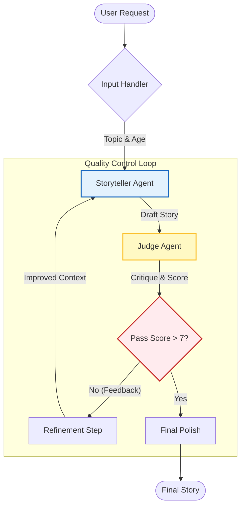

# Hippocratic_Assessment
A self-correcting bedtime story generator powered by OpenAI. Features an iterative 'Actor-Critic' architecture where a Judge agent automatically critiques and refines content for quality and safety.

## System Architecture



## 🚀 How to Run

### 1. Prerequisites
* Python 3.8 or higher
* An OpenAI API Key

### 2. Setup
Clone the repo and install the required library:
```bash
pip install openai
